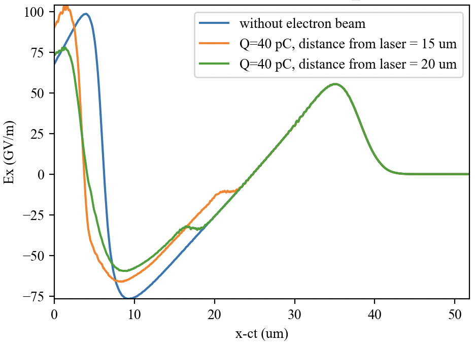
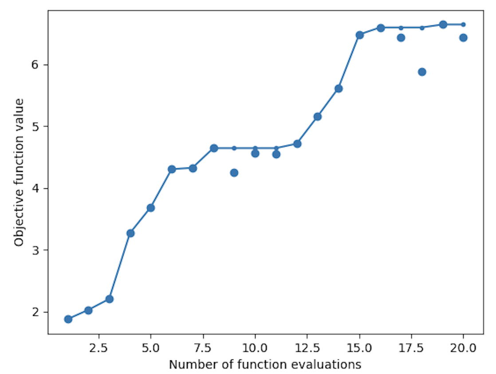
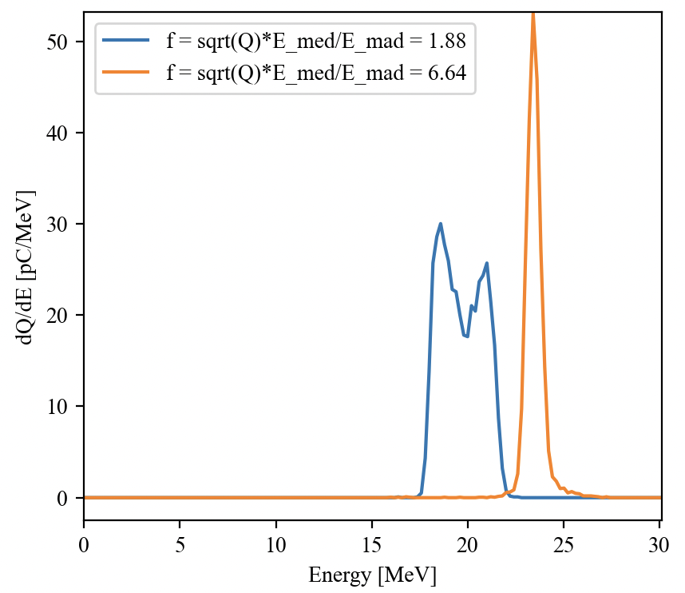

# Optimization of Particle in Cell simulations

This example shows how to perform an optimization with a Particle in Cell (PIC) 
code on a multi-cpu laptop, workstation, or a supercomputing cluster.

This kind of simulation can be used to design e.g. laser-plasma interaction 
experiments, where a physical quantity or a combination of physical quantities 
(e.g. the energy of accelerated electron beam) can be optimized through an appropriate 
choice of experimentally accessible parameters.

Note that the simulation parameters were chosen to yield very quick simulations,
suited for learning how to set up an optimization workflow.
More realistic simulations for the chosen physics case would need to simulate longer propagation distances and with a finer mesh for a start.

While this example uses the PIC code Smilei (https://github.com/SmileiPIC/Smilei.git) to optimize a Laser Wakefield Acceleration scheme, 
it can be easily adapted to other simulation codes and use cases.

## To run this example on a multi-cpu laptop or workstation

Before running this kind of optimization on a supercomputing cluster, it is 
recommended to test it on a workstation. 
The following will assume that the machine is a multi-cpu laptop or workstation with a Linux-like operating system.

Note that the PIC simulation folders created during the optimization will take 
about 0.5 GB of space. The current configuration ensures that each simulation will take a few minutes on one cpu (20 simulations in total) and that only one simulation will be running at a given time if the optimization run is not restarted. In the latter case, ensure to kill the previously launched simulations.

Instructions:
- Download the optimization library ``:Discoveri``.
- Download and install the PIC code ``Smilei`` (https://github.com/SmileiPIC/Smilei.git) on the machine you want to use. 
- Install the ``Smilei`` postprocessing library ``happi`` (installing first the ``pint`` library for unit conversions).
- Create a directory, e.g. ``optimization_runs`` and copy inside the ``smilei`` executable, the files ``namelist_optimization_LWFA.py``, ``launch_Smilei_simulation.sh``, and ``postprocessing_functions.py`` from this directory.
- Inside this directory, create a folder for the optimization run, called e.g. ``run_0``.
- In ``run_0``, copy the script ``Optimization_Smilei_simulation.py``.
- In that file, modify the path of the ``:Discoveri`` folder on your machine.
- Navigate to ``run_0`` and run the script ``Optimization_Smilei_simulation.py`` (this was tested using `IPython`).
- Use the ``:Discoveri`` postprocessing scripts to analyse the optimization run results.
- To understand the physics simulated in selected PIC simulations created during the optimization run, 
use ``happi`` or other tools to postprocess the PIC simulations.

## To run this example on a supercomputing cluster 

The workflow on a supercomputing cluster is essentially the same as on a local workstation,
except for two main differences:
- The ``Optimization_Smilei_simulation.py`` can be run either on the frontal nodes (not recommended),
or as a job on the cluster (recommended). The command ``screen`` can assist you on the frontal nodes.
- Adapt the content of the file ``launch_Smilei_simulation.sh``. It should load the same environment used to compile ``Smilei`` on the cluster. Further, it should have the commands to submit a ``Smilei`` simulation to the batch scheduling system of the cluster. If computing resources are available, feel free to use more cpus for a given simulation.

## The optimized physics case
Laser Wakefield Acceleration (LWFA) [1] is a particle acceleration 
technique based on the generation of plasma waves in the wake of a short, intense 
laser pulse propagating in a low density plasma. Short relativistic electron 
beams, copropagating with the plasma wave at the right phase of the longitudinal electric field, can gain significant energy over short distances. 

In the scheme chosen for this example, a short electron beam 
with initial energy equal to 15 MeV and initial energy spread equal to 1% is externally injected 
in the plasma wave behind the laser pulse. 

Some proposed applications of this technique require the generation of electron 
beams with high total charge, a high energy and low relative energy spread. In this use case we choose to optimize then an objective function equal to
``f=sqrt(Q)*E_med/E_mad``, proposed in [2], where ``Q`` is the total charge 
of the electron beam, ``E_med`` is its median energy and ``E_mad`` is its 
median absolute deviation from the median energy. For the optimization, `f` is 
evaluated at the end of the simulation, after a short propagation in the plasma.

For this use case, the laser and plasma parameters in the simulation input file 
``namelist_optimization_LWFA.py`` are fixed, and we try to optimize the objective 
function by changing the parameters ``"bunch_charge_pC"`` and ``"electron_bunch_delay_behind_laser_um"``, i.e. the electron beam charge in pC and the 
distance in micron after the laser pulse peak where the electron beam is injected.

The chosen laser and plasma parameters are in a nonlinear regime of LWFA, where 
an analytical optimization of the objective function is not possible and PIC 
simulations are necessary to evaluate it. Different physical effects compete 
in the final value of the objective function: depending on the beam injection position, different values of the beam charge can modify 
the plasma wave and thus the accelerating field acting on the electron beam (an effect called beam loading, see Fig. 1), 
increasing or decreasing its final energy. The resulting distribution of the accelerating field would also 
be affected, potentially accelerating different parts of the beam with different electric 
field amplitudes and increasing the final energy spread, or reducing its energy spread if the average accelerating field is flat for the beam extension [2]. 

<p align="center">
  <figure>
    
    <figcaption>Figure 1: Snapshot of the longitudinal electric field Ex on the propagation axis of the plasma wave for three different simulations. The final energy and energy spread of the accelerated beam strongly depends on the amplitude and shape this curve. Q is the charge of the electron bunch.  </figcaption>
  </figure>
</p>

## The optimization process
In the current configuration in the file ``Optimization_Smilei_simulation.py``, the chosen derivative-free optimization method is Bayesian Optimization (for an introduction, see https://machinelearningmastery.com/what-is-bayesian-optimization/). 

In this file, the search space for the parameters to optimize is specified, as well as how many optimization iterations (currently 20) and how many PIC simulations per iteration (currently 1) are run to optimize `f`.

The paths for ``Smilei``, the input namelist and the script to launch simulations are provided as well.
Finally, an implementation of the function `f` to maximize is provided in the script ``postprocessing_functions.py``.

Every time the optimization process needs to launch a simulation, it creates a new directory named ``Config_*``, where the executable ``smilei``, the Python input namelist and the ``.sh`` script are copied.

Afterwards, the process inserts a new line into the input namelist to define a dictionary ``configuration`` containing the parameters for that specific simulation configuration. 
For this example, the namelist of one configuration may contain these parameters:
``` 
configuration = { 'bunch_charge_pC':85.22, 'electron_bunch_delay_behind_laser_um':17.97 }
```

This line is automatically added immediately after the marker ``# Configuration to simulate`` at the beginning of the input namelist.
The namelist is structured to use the parameters defined in this dictionary at the start of the execution. In the process, a file called ``list_configurations.csv`` will store the parameter configuration associated to each directory ``Config_*``.

Finally, the simulation is launched by executing the ``.sh`` file. The optimizer will periodically check if the log file of the launched simulation(s) ``smilei.log`` contains the word ``END``, which marks the end of the simulation. When this occurs, it will postprocess the simulation results using the provided postprocessing function, which will return the value of ``f`` associated to the parameter configuration explored by the simulation. When all the simulations for that optimization iteration are postprocessed, a new optimization iteration can start.

## Analysing the results of the optimization run

The script ``postprocessing_scripts/readAndPlotOptimizationHistory.py``, when used in the folder containing the optimization outputs, will generate some figures to analyse the optimization process. Fig. 2 in particular shows the evolution of the best objective function value found during the optimization.

<p align="center">
  <figure>
    
    <figcaption>Figure 2: Example of evolution of the objective function to maximise, as function of the number of function evaluations. The big markers correspond to the value of the objective function at that function evaluation. The line represents the best value found so far, showing the progress of the optimization process. Given the non-deterministic nature of Bayesian Optimization, running again the optimization process will likely yield a slightly different curve.  </figcaption>
  </figure>
</p>

In the file `postprocessing_function` the function `Plot_energy_spectrum` (which uses ``happi``) can plot the energy spectrum of a simulation. Using this function, the energy spectra of the first and the best simulation run during the optimization process are plotted in Fig. 3. As expected, maximizing ``f`` gives a more peaked spectrum, with more charge and higher energy.

<p align="center">
  <figure>
    
    <figcaption>Figure 3: Energy spectra and objective function value corresponding to the first and best simulation run during the optimization process. Given the non-deterministic nature of Bayesian Optimization, running again the optimization process will likely yield different curves.  </figcaption>
  </figure>
</p>

Note that, since the objective function ``f`` is unknown analytically, it is impossible to determine if the optimum found by the optimization process is a global optimum without further investigation. For example, extending the optimization run and running more independent optimization runs with different optimization methods (e.g. a Random Search, or a Particle Swarm Optimization) may help gather more knowledge on the shape of ``f``.

Further, a different definition of objective function will likely yield different optimized energy spectra.

# References

[1] E. Esarey et al., Physics of laser-driven plasma-based electron accelerators, Rev. Mod. Phys. 81, 1229 (2009) https://doi.org/10.1103/RevModPhys.81.1229
    
[2] S. Jalas et al., Bayesian Optimization of a Laser-Plasma Accelerator, Phys. Rev. Lett. 126, 104801 (2021) https://doi.org/10.1103/PhysRevLett.126.104801
    

